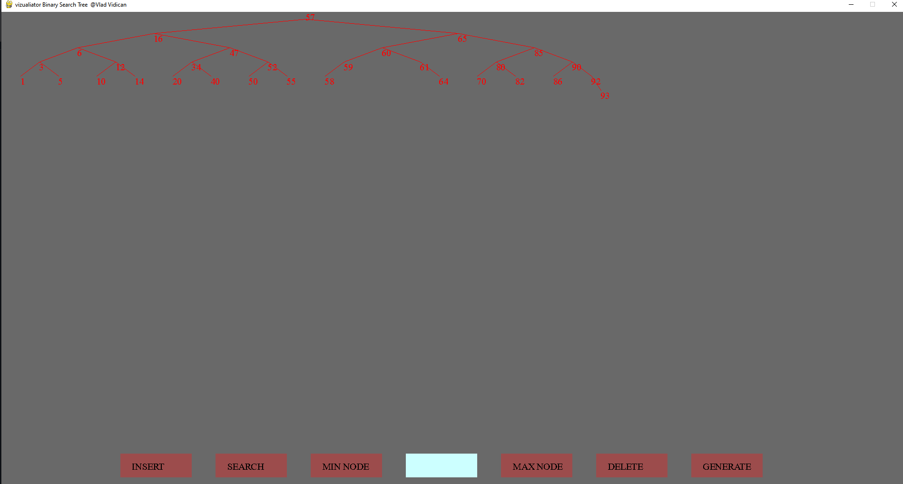

# BST_Vizualizer
This is a Binary Search Tree vizualizer made using  python and the pygame module.\
it was a school project for my data structures class\
\

\
\
it's main features are:\
-add a node\
-delete a node\
-show max/min node in a tree\
-search for a node in a tree\
-generate a random tree\
\
the algorithm i used in order to determine the position at which i should draw each node so that they do not overlap is quite simple, thus, not really great

im basically building the tree from top to bottom (leafs first, root last) and doubling the  horizontal spacing between nodes at each level
a 6-levels tree was all it could handle on my screen before the tree was no longer completely visible

i dont know how you stumbled into this but if have a suggestion for a better way to draw binary trees, i would really like to know 

i am planning to extend this vizualizer to multiple binary trees in a not-so-near future
